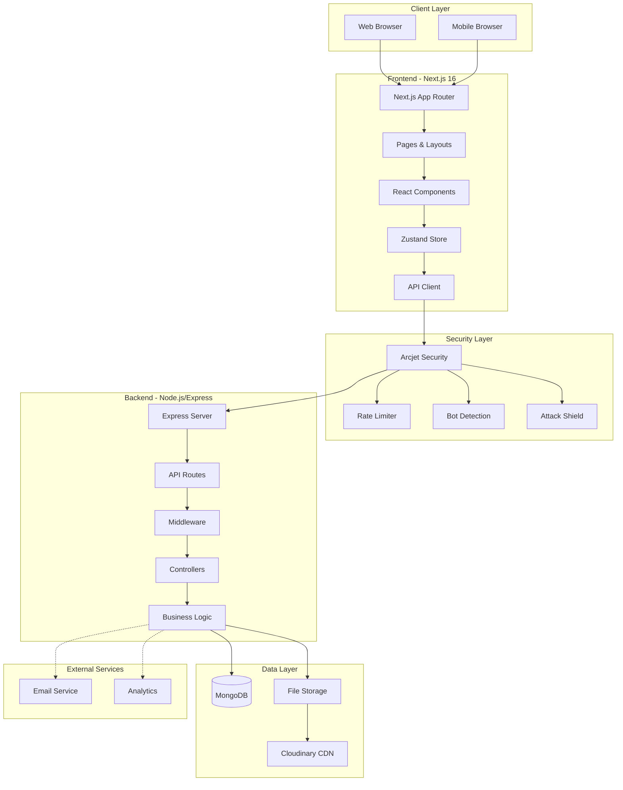
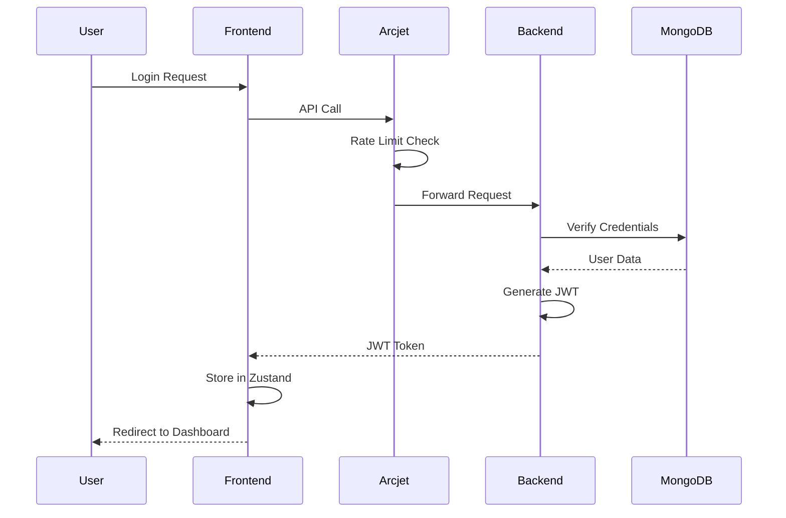
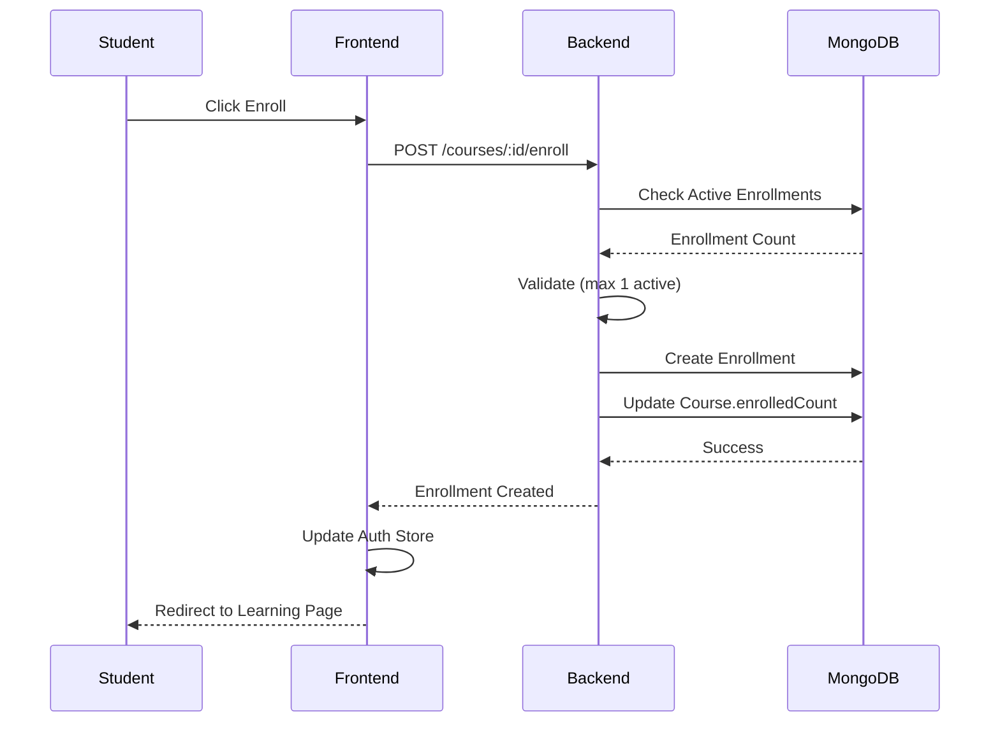
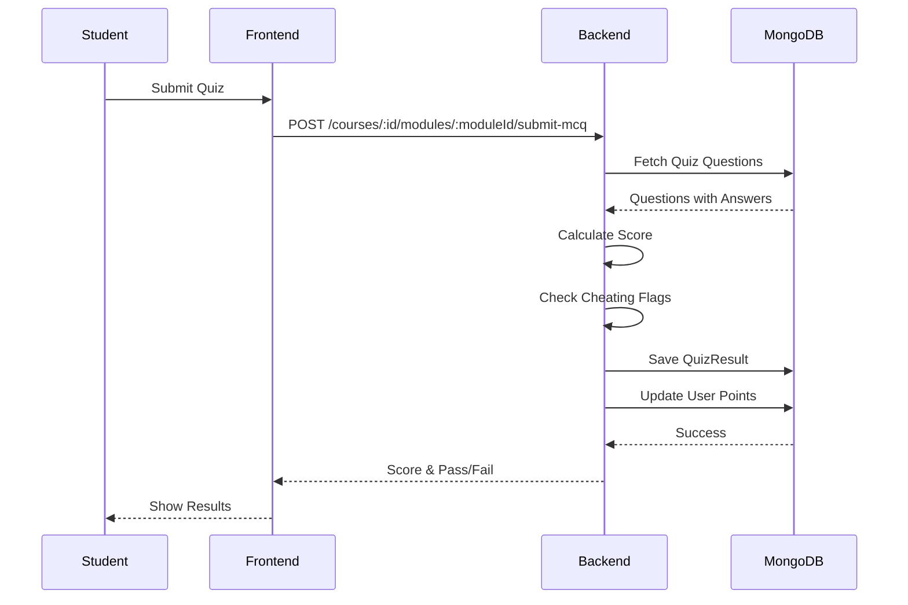
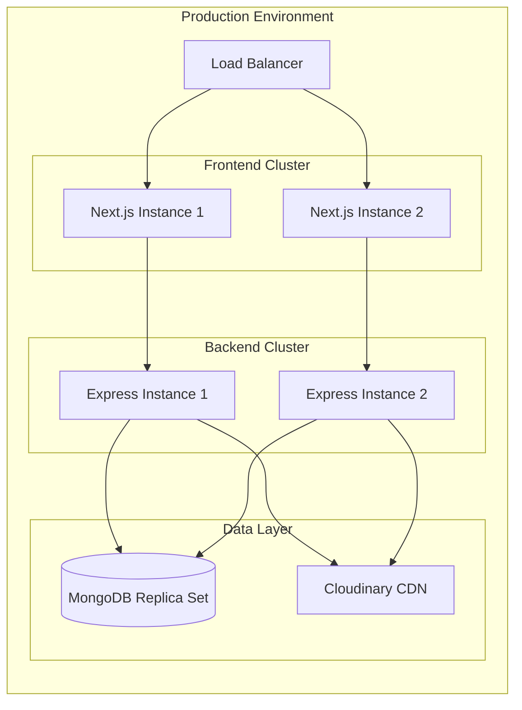

# Build To Learn LMS - High-Level Architecture

## System Overview

Build To Learn is a full-stack Learning Management System built with a modern microservices-inspired architecture, utilizing Next.js for the frontend and Node.js/Express for the backend, with MongoDB as the primary database.

---

## Architecture Diagram



---

## Technology Stack

### Frontend
- **Framework**: Next.js 16 (App Router)
- **Language**: JavaScript (ES6+)
- **UI Library**: React 18
- **Styling**: Tailwind CSS
- **Component Library**: Shadcn UI (Radix Primitives)
- **State Management**: Zustand
- **Form Handling**: React Hook Form
- **Media Player**: react-player
- **Markdown**: react-markdown

### Backend
- **Runtime**: Node.js
- **Framework**: Express.js
- **Language**: JavaScript
- **Database**: MongoDB (Mongoose ODM)
- **Authentication**: JWT (jsonwebtoken)
- **Password Hashing**: bcryptjs
- **File Upload**: Multer
- **Security**: Arcjet, Helmet, CORS

### Infrastructure
- **Database**: MongoDB Atlas / Local MongoDB
- **File Storage**: Cloudinary (images) / Local storage (fallback)
- **Security**: Arcjet (bot detection, rate limiting, attack shield)

---

## Core Components

### 1. Frontend Architecture

#### App Router Structure
```
app/
├── (auth)/          # Authentication routes
├── (dashboard)/     # Protected dashboard routes
├── (public)/        # Public-facing pages
├── learning/        # Dedicated learning interface
└── layout.jsx       # Root layout
```

#### State Management
- **Zustand Stores**:
  - `useAuthStore`: User authentication state
  - `useCourseStore`: Course catalog and details
  - Global state for UI preferences

#### Component Hierarchy
```
Layout Components
├── Navbar (Public)
├── Sidebar (Dashboard)
└── Footer

Feature Components
├── CourseCard
├── ModuleList
├── LessonPlayer
├── MCQPlayer
└── CertificateView

UI Components (Shadcn)
├── Button, Input, Card
├── Dialog, Sheet, Tabs
└── ScrollArea, Badge
```

### 2. Backend Architecture

#### Module Structure
```
modules/
├── auth/            # Authentication & authorization
├── users/           # User management
├── course/          # Course CRUD operations
├── certificate/     # Certificate generation
├── forum/           # Community forum
├── community/       # Blog posts
├── gamification/    # Leaderboard & points
├── admin/           # Admin operations
└── upload/          # File upload handling
```

#### Middleware Stack
1. **Arcjet Security** (bot detection, rate limiting, shield)
2. **CORS** (cross-origin resource sharing)
3. **Helmet** (security headers)
4. **Morgan** (logging)
5. **Authentication** (JWT verification)
6. **Error Handling** (centralized error responses)

### 3. Database Architecture

#### Collections (10)
1. **Users** - User accounts and profiles
2. **Courses** - Course catalog
3. **Modules** - Course curriculum units
4. **QuizResults** - Quiz attempt tracking
5. **Certificates** - Achievement certificates
6. **Posts** - Forum and blog posts
7. **Comments** - Nested comment threads
8. **Enrollments** - Embedded in Users
9. **Skills/Experience/Education** - Embedded in Users
10. **Quiz Questions/Options** - Embedded in Modules

---

## Data Flow

### 1. User Authentication Flow


### 2. Course Enrollment Flow


### 3. Quiz Submission Flow


---

## Security Architecture

### 1. Arcjet Security Layer
- **Bot Detection**: Blocks malicious bots, allows search engines
- **Rate Limiting**: Token bucket algorithm (5 req/10s, capacity 10)
- **Shield**: Protection against SQL injection, XSS, CSRF

### 2. Authentication & Authorization
- **JWT Tokens**: Stored in HTTP-only cookies
- **Role-Based Access**: Public, Student, Instructor, Admin
- **Protected Routes**: Middleware checks for valid JWT

### 3. Data Validation
- **Backend**: express-validator for input sanitization
- **Frontend**: React Hook Form with Zod schemas
- **Database**: Mongoose schema validation

---

## Scalability Considerations

### Horizontal Scaling
- **Frontend**: Stateless Next.js instances (Vercel/Docker)
- **Backend**: Multiple Express instances behind load balancer
- **Database**: MongoDB replica sets for read scaling

### Caching Strategy
- **Frontend**: Next.js static generation for public pages
- **Backend**: Redis cache for frequently accessed data (future)
- **CDN**: Cloudinary for image/video delivery

### Performance Optimization
- **Code Splitting**: Next.js automatic code splitting
- **Lazy Loading**: React.lazy for heavy components
- **Database Indexes**: Optimized queries on frequently accessed fields
- **Image Optimization**: Next.js Image component

---

## Deployment Architecture



---

## Monitoring & Logging

### Application Monitoring
- **Morgan**: HTTP request logging
- **Console Logs**: Error tracking and debugging
- **Arcjet Inspect**: Security event monitoring

### Performance Metrics
- **Response Times**: API endpoint latency
- **Database Queries**: Slow query detection
- **Error Rates**: 4xx/5xx response tracking

---

## Future Enhancements

1. **Microservices Migration**: Separate services for auth, courses, certificates
2. **Redis Caching**: Session storage and query caching
3. **WebSocket Integration**: Real-time notifications and chat
4. **GraphQL API**: Alternative to REST for flexible queries
5. **Kubernetes Deployment**: Container orchestration
6. **CI/CD Pipeline**: Automated testing and deployment

---

*Build To Learn LMS - High-Level Architecture v1.0*
